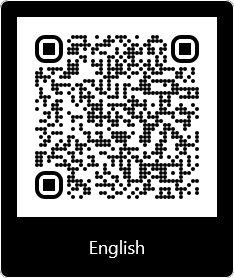
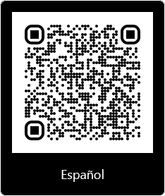

# cv

Bilingual CV made with LaTeX.

Based on:
- https://github.com/danthelion/resume
- https://github.com/posquit0/Awesome-CV


To build it with docker:

```bash
sudo docker build -t latextopdf:v1 .
sudo docker run -v "$PWD":/data latextopdf:v1
```

To build it locally (requires texlive full distribution or figuring out what
packages requires and installing only those):

```bash
mkdir -p out/eng
mkdir -p out/esp
xelatex -output-directory=out/eng "\newcommand{\english}{true} \input{cv.tex}"
xelatex -output-directory=out/esp "\newcommand{\english}{false} \input{cv.tex}"
```

Links to my CV:
- [English](https://raw.githubusercontent.com/ander94lakx/cv/master/out/eng/cv.pdf)
- [Spanish](https://raw.githubusercontent.com/ander94lakx/cv/master/out/esp/cv.pdf)


QR codes:



